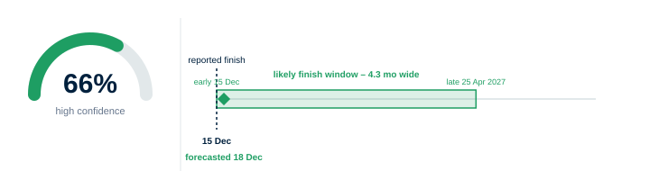
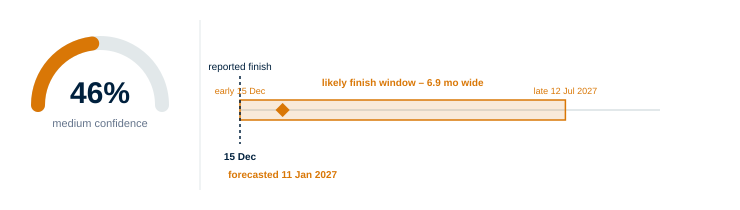
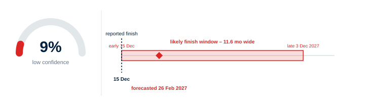

## Forecast Confidence

When a project reports a finish date, there is often no way to tell at a glance whether that date is genuinely achievable or quietly optimistic. Some schedules lose roughly a month of completion date for every month that passes, while still looking healthy on paper – the delay is hiding in work that hasn't started yet. Others show what appears to be a recovery, but the recovery was manufactured by cutting planned durations and adding logic links, not by real progress on site.

Forecast Confidence gives you an honest trust read on the reported finish date. It's shown as a percentage, but it should be read as a band – green, amber, or red – rather than a precise score: the difference between 48% and 52% isn't meaningful, only which band you land in is. It's built from the schedule's own update history: is the finish date stable, how consistently has it moved, and how much float has the programme burned through.

A planner or project manager can use this to answer the question "should I believe the finish date?" in seconds – and if the answer is amber or red, the detail behind the signal shows exactly why.

## Report details

A confidence gauge showing a percentage and a green, amber, or red read, with a one-line explanation underneath.

Below the gauge, a timeline shows the **data date of each uploaded update**, the **reported finish date**, a **forecasted (rules-adjusted) finish date**, and an **early/late likely range** either side of it. There is no separate "today" marker – the most recent point plotted is the latest update's own data date, not necessarily today's calendar date. The confidence percentage is a measure of how wide that likely range is relative to the time remaining – a tight range against a long remaining duration reads as high confidence; a wide range against a short remaining duration reads as low confidence.

Below the timeline, a **Reliability Factors** grid lists the individual metrics the model is built from, each with its own small sparkline (the last 13 updates) and a green/amber/watch status word:

| Metric | What it reflects |
|---|---|
| Task-count growth | How much the activity count has grown since the first uploaded update. *Calculation:* (activity count at the latest update ÷ activity count at the first update − 1) × 100. |
| Overall slip ratio | How far the forecast finish has moved, relative to time elapsed. *Calculation:* months of slip at the latest update ÷ months elapsed since the first update. |
| Step-to-step volatility | How much the forecast finish jumps around from one update to the next, rather than drifting smoothly. *Calculation:* the standard deviation of the month-to-month change in slip, taken across every consecutive pair of updates. |
| Median float (latest) | The typical spare time left across incomplete activities in the most recent update. *Calculation:* the median total float, in days, across incomplete activities in that update only. In practice this tile only ever reads green or red – the amber band sits between two thresholds that can't both be reached at once, so it never appears. |
| Negative-float share (latest) | The share of incomplete activities currently out of spare time. *Calculation:* percentage of incomplete activities with negative float, in the most recent update only. |
| Peak negative-float share | The worst that negative-float share has been across the whole series, not just the latest update. *Calculation:* the highest negative-float share recorded at any single update across the whole series. |
| Recent slip rate | How fast the finish date has been moving out lately, ignoring older history. *Calculation:* slip rate measured over just the last six updates (or fewer, if the project has fewer than six). |
| Normalised slip rate | The worst pace of slip the project has ever shown, at any point. *Calculation:* the single highest slip-ratio value recorded at any update across the whole series – a peak-ever measure, not a current one. |
| Central slip rate | The rate the model actually trusts once the above are weighed against each other. *Calculation:* a recency-weighted median of the update-to-update marginal slip rates, so recent movement counts for more than movement from further back. The on-screen label describes an older, simpler formula (the highest of the three rates above); the number actually shown uses this weighted-median calculation instead whenever there's enough update history to run it – which is true for almost every project with two or more updates. |

A separate **Forecast honesty** panel sits alongside this grid, showing how well completed work has tracked the plan (comparing planned vs. actual finish dates for everything that's finished so far). This is shown for information – **it is not one of the inputs to the confidence percentage itself** (see Calculation, below); read it as a second opinion, not a component of the gauge.

## Calculation and other logic

**Data used:** every schedule update file uploaded for the project, plus the activity identified as the project completion milestone – auto-detected by name (activities named along the lines of "Practical Completion" are prioritised, then "Final/Contract/All of the Works/Project Completion," then a generic "Completion").

**Which files count:** each update file is compared against the largest uploaded file using a **Jaccard similarity** score – the number of activity codes the two files share, divided by the total number of distinct codes across both. A file scoring below 0.5 (fewer than half its codes in common with the largest file) is treated as a different schedule's data and excluded from the read. The remaining files are lined up in date order to track how far the completion milestone's forecast date has moved and how fast.

**The forecasted finish date** starts from the reported finish date and shifts it forward by an amount based on the project's current slip rate (the Central slip rate from the table above), capped so one bad reading can't push the forecast out by more than one and a half times however much programme time is left:

> Forecasted finish = reported finish + (current slip rate × months remaining), capped at 1.5 × months remaining

**The likely-finish range** is drawn around that forecasted date. How wide it is depends on how volatile the schedule has been recently, weighed against how much time is actually left – more time remaining allows a wider range, and a schedule with a longer run of updates behind it gets a tighter range than one with only a couple of updates to go on:

> Half-width (in months) = the larger of *(months remaining × (0.15 + 0.25 × volatility score))* or *(2 + 3 × volatility score)*, then narrowed by an update-count adjustment – the square root of (6 ÷ number of updates used, or 2 if there are fewer than 2 updates)

The range isn't centred evenly either side of the forecasted date either – it leans further toward *later* than earlier, because in practice projects are far more likely to slip later than to genuinely pull earlier:

> Early bound = forecasted shift − (0.6 × half-width), never earlier than the reported finish date itself
> Late bound = forecasted shift + (1.4 × half-width)

**The volatility score** used above combines three of the Reliability Factors, each scaled onto a comparable range first and then weighted so step-to-step volatility counts for the most, scope growth next, and negative float least. "Recent" here means roughly the last 3–6 updates, not the whole series:

> Volatility score = 0.5 × (recent step-to-step volatility ÷ 3) + 0.3 × (recent effective scope growth ÷ 40) + 0.2 × (recent peak negative-float share ÷ 100), capped at 1.2

**Turning the range into a percentage:** the confidence percentage compares the width of the likely-finish range (late bound minus early bound) against how much time is left on the project – a range that's narrow relative to the time remaining reads as high confidence, a wide one reads as low confidence:

> Confidence % = 100 × (1 − (width of the likely-finish range ÷ (months remaining × 0.8 + 8))), rounded, and held between 5% and 95%

The `+ 8` is a fixed allowance built into that comparison, so a project with almost no time left doesn't automatically look highly confident just because there's barely anything left to slip. The confidence band is **60% or above is green, 40–59% is amber, below 40% is red.**

**Forecast honesty panel:** a genuinely separate calculation from everything above, not one of its inputs. For every activity that has actually finished, Logic+ compares its actual finish date against the finish date that activity was originally given, back when it first appeared in an uploaded schedule, and averages that gap across everything finished so far at each update – a running track record of how far real progress has drifted from the original plan over time. Once at least 20 activities have finished across at least 4 updates, Logic+ checks how closely that track record moves in step with the reported finish date's own slippage, using a statistical technique called a Pearson correlation. A strong match means the reported date is backed up by what's actually happening on site; a weak or absent match means the reported date is moving independently of real progress – exactly the "looks fine on paper" pattern this module exists to catch. Below that 20-activity/4-update threshold there isn't enough finished work to judge reliably, so no real reading is shown. Don't read the honesty panel as explaining the confidence percentage – the two are calculated independently and can genuinely disagree.

## Worked examples: what drives a high, medium, or low confidence

The Reliability Factors don't add up to the confidence percentage – they explain it. Each one widens or narrows the likely-range window described above; the confidence percentage then falls out of comparing that window's width against how much time is left. Two schedules with very different Reliability Factors can land on a similar confidence percentage, and that's expected.

The three examples below use the same illustrative project throughout – six monthly updates so far, six months of programme left, reported finish 15 December – with only the schedule's underlying health changing between them. They're representative inputs, not pulled from a real run, but the confidence percentages they produce are worked through the actual formula.

**High confidence – around 65–70%**

The Reliability Factors all score healthy: task-count growth low and steady, step-to-step volatility low (the forecast finish barely moves update to update), negative-float share low, and the slip-rate factors all close to flat – the schedule is tracking close to plan.

What you'd see: the forecasted finish sits only a few days past the reported one (18 December vs. 15 December), and the window stretches from the reported date itself out to around 25 April – wide in absolute terms, but narrow relative to the six months still on the clock. That's the shape behind high confidence in Logic+: not a pinpoint date, but a window that isn't ballooning outward.

**Medium confidence – around 40–55%**

The Reliability Factors are mixed: moderate task-count growth, moderate step-to-step volatility, negative-float share creeping up, and a slip rate that's clearly non-zero but not extreme – a combination that comes across as worth watching, rather than healthy or in trouble.

What you'd see: the forecasted finish moves out to around 11 January, and the window widens out to run from 15 December to mid-July – more than a month of central shift, and a window wider than the time remaining. This is the zone where the reported date needs real scrutiny before it's repeated to a client.

**Low confidence – below 40%**

Several Reliability Factors are in trouble at once: high task-count growth, high step-to-step volatility, a high negative-float share, and a slip rate that's losing a meaningful fraction of a month for every month that passes.

What you'd see: the forecasted finish moves to late February – more than two months past what's reported – and the window stretches from 15 December all the way out to early December the *following* year, nearly doubling the whole remaining duration. At this point the reported date isn't a useful anchor on its own; the width of the window is the real message.

## Note

At least two schedule updates sharing a common completion milestone are needed to produce a read. With fewer, no signal is shown.
